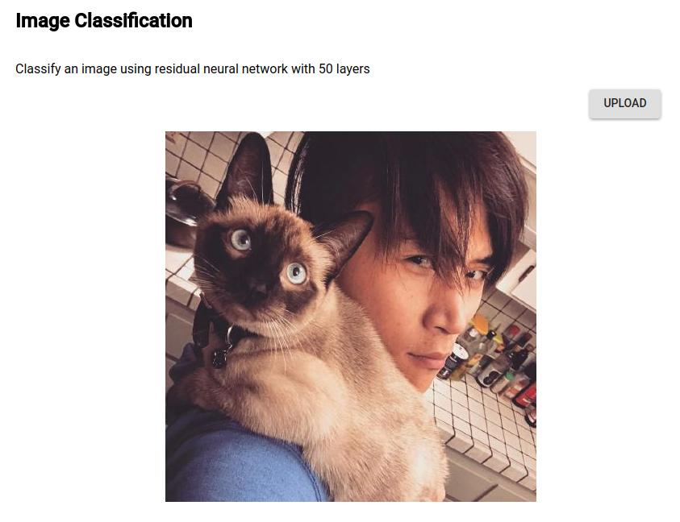
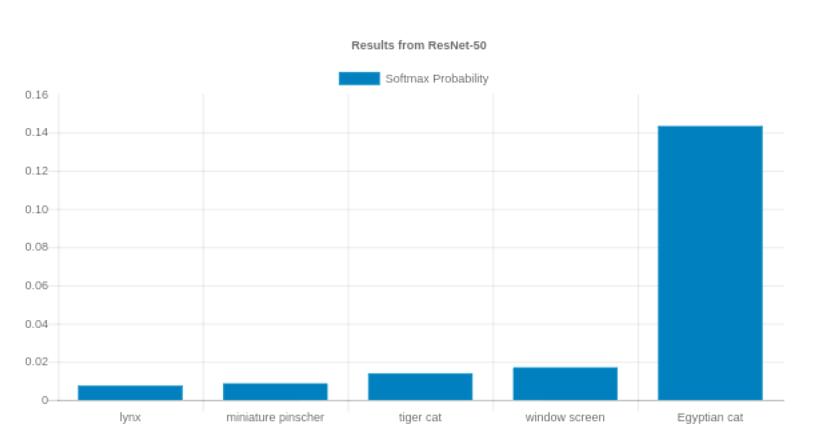

# Image Classification - TensorFlow in Go
## What is it?
It's a simple application that allows you to upload an image and performs classification on it.

First, user clicks upload and select an image:


Then the server will run the image through a residual neural network with 50 layers and compute an
answer:



## Run With Docker
### Build The Image
The easiest way to run this project is through docker. First, build the image.

    docker build -t tensorgo .

And then run the image in a container and publish port to 3000

    docker run --publish 3000:3000 tensorgo

Now you can see the app on `localhost:3000`!

### Didn't work?
If you are experiencing error regarding model failed to load or complaint from TensorFlow about 
`cannot find model`, then that means you probably need to run the Python script to build the model
first and then build Docker image.

Create a virtual environment and install requirements using `pip`:

    virtualenv environment
    source environment/bin/activate
    pip install -r requirements.txt

Now navigate to `tf_models/` folder and run one of the Python scripts:

    python create_resnet_model.py

Now build again:

    docker build -t tensorgo .

## Run Without Docker
### Prerequisites
* Go 1.8+
* Node 6+
* Python 2.7+

### Install TensorFlow C binding
[Source](https://www.tensorflow.org/install/install_c): Execute the following shell command
```
 TF_TYPE="cpu" # Change to "gpu" for GPU support
 OS="linux" # Change to "darwin" for macOS
 TARGET_DIRECTORY="/usr/local"
 curl -L \
   "https://storage.googleapis.com/tensorflow/libtensorflow/libtensorflow-${TF_TYPE}-${OS}-x86_64-1.8.0.tar.gz" |
   sudo tar -C $TARGET_DIRECTORY -xz
```

Then configure the linker
```
sudo ldconfig
```

### Install Project Dependencies
Once TensorFlow is installed, next is to install Go dependency
```
dep ensure
```

Then compile Go source code
```
go install
```

Install node modules for building the frontend
```
npm install
```

Then build it
```
npm run build
```

### Compile TensorFlow Model
Create a virtual environment and install requirements using `pip`:

    virtualenv environment
    source environment/bin/activate
    pip install -r requirements.txt

Now navigate to `tf_models/` folder and run one of the Python scripts:

    python create_resnet_model.py

Now you are ready to go.

## Start
Simply do

    tensorgo start
